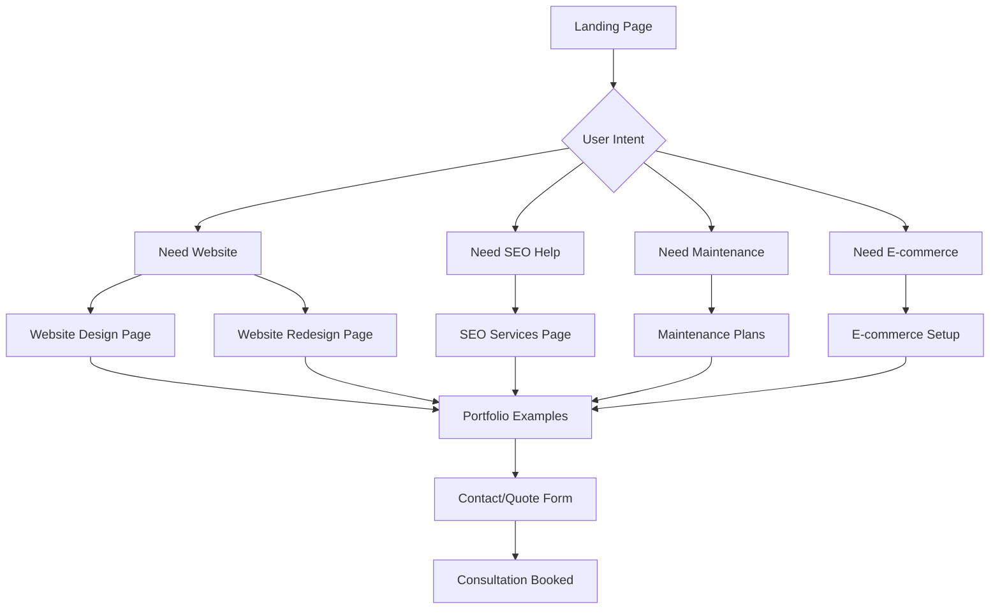

# TechFlow Solutions - Complete Website Redesign Master Plan

## 🎯 Project Overview

**Objective**: Complete ground-up redesign of TechFlow Solutions website, pivoting from PC repair focus to digital solutions provider specializing in website design and development services.

**Timeline**: Comprehensive rebuild with modern, professional architecture
**Target Market**: Small businesses seeking digital solutions and online growth
**Primary Services**: Website Design, SEO, E-commerce, Digital Solutions

---

## 📊 Current Site Analysis

### ✅ Components to Preserve
- **Technical Infrastructure**: Google Analytics (GTM-M2VPMC5V), robots.txt deployment
- **Domain**: techflowsolutions.ca
- **Contact Information**: Phone (647) 572-8321
- **Service Area**: Greater Toronto Area
- **Modern CSS Architecture**: CSS variables, mobile-first approach
- **Performance**: Font optimization, asset versioning

### ❌ Components to Replace
- **All PC repair-focused content and messaging**
- **Current navigation structure**
- **Service descriptions and positioning**
- **Visual branding and color scheme**
- **Page structure and user flows**

---

## 🏗️ New Website Architecture

### Site Structure & Navigation
```
📁 TechFlow Solutions (Digital Solutions Provider)
├── 🏠 Home (index.html)
├── 💼 Services (services.html)
├── 🎨 Website Design (website-design.html) 
├── 🔄 Website Redesign (website-redesign.html)
├── 📈 SEO Services (seo-services.html) 
├── 🛠️ Maintenance Plans (maintenance.html)
├── 🛒 E-commerce Setup (ecommerce.html)
├── 📱 Portfolio (portfolio.html)
├── 👥 About (about.html)
├── 📞 Contact (contact.html)
├── 💰 Get Quote (quote.html)
└── 🔧 IT Support (it-support.html) [Secondary Service]
```

### User Journey Flows


---

## 🎨 Visual Identity & Branding

### New Brand Positioning
**From**: "PC Repair & Networking Services"
**To**: "Digital Solutions Provider - Websites That Drive Business Growth"

### Color Palette (Professional Digital Agency)
```css
:root {
    /* Primary Brand Colors */
    --primary-blue: #2563eb;      /* Professional blue */
    --secondary-blue: #1d4ed8;    /* Darker blue */
    --accent-teal: #0891b2;       /* Modern teal accent */
    
    /* Supporting Colors */
    --success-green: #059669;     /* Success/growth */
    --warning-orange: #d97706;    /* Attention/CTA */
    --neutral-slate: #475569;     /* Text secondary */
    
    /* Background & Text */
    --bg-primary: #ffffff;        /* Clean white */
    --bg-secondary: #f8fafc;      /* Light gray */
    --bg-dark: #0f172a;          /* Dark sections */
    --text-primary: #1e293b;      /* Dark text */
    --text-secondary: #64748b;    /* Muted text */
    --text-light: #ffffff;        /* White text */
}
```

### Typography System
```css
/* Professional Typography Stack */
--font-primary: 'Inter', system-ui, sans-serif;     /* Clean, modern */
--font-heading: 'Poppins', 'Inter', sans-serif;     /* Friendly headings */
--font-mono: 'JetBrains Mono', monospace;           /* Code/technical */

/* Type Scale */
--text-xs: 0.75rem;    /* 12px */
--text-sm: 0.875rem;   /* 14px */
--text-base: 1rem;     /* 16px */
--text-lg: 1.125rem;   /* 18px */
--text-xl: 1.25rem;    /* 20px */
--text-2xl: 1.5rem;    /* 24px */
--text-3xl: 1.875rem;  /* 30px */
--text-4xl: 2.25rem;   /* 36px */
--text-5xl: 3rem;      /* 48px */
```

---

## 📱 Responsive Layout System

### Breakpoint Strategy
```css
/* Mobile-First Breakpoints */
--mobile: 0px;           /* 0-767px */
--tablet: 768px;         /* 768-1023px */
--desktop: 1024px;       /* 1024-1439px */
--wide: 1440px;          /* 1440px+ */

/* Container Widths */
--container-mobile: 100%;
--container-tablet: 750px;
--container-desktop: 1200px;
--container-wide: 1400px;
```

### Grid System
```css
/* CSS Grid Layout */
.grid-12 { display: grid; grid-template-columns: repeat(12, 1fr); }
.grid-6 { display: grid; grid-template-columns: repeat(6, 1fr); }
.grid-4 { display: grid; grid-template-columns: repeat(4, 1fr); }
.grid-3 { display: grid; grid-template-columns: repeat(3, 1fr); }
.grid-2 { display: grid; grid-template-columns: repeat(2, 1fr); }

/* Responsive Grid */
@media (max-width: 768px) {
    .grid-12, .grid-6, .grid-4, .grid-3 {
        grid-template-columns: 1fr;
    }
    .grid-2 {
        grid-template-columns: 1fr;
    }
}
```

---

## 🧩 UI Component Library

### Core Components
1. **Navigation**
   - Desktop horizontal navigation
   - Mobile hamburger menu
   - Sticky header with scroll effects
   - Breadcrumb navigation

2. **Hero Sections**
   - Primary hero with video background
   - Service page heroes with imagery
   - Call-to-action overlays

3. **Cards & Content**
   - Service cards with hover effects
   - Portfolio project cards
   - Testimonial cards
   - Pricing cards

4. **Forms & CTAs**
   - Contact forms with validation
   - Quote request forms
   - Newsletter signup
   - Button variations (primary, secondary, ghost)

5. **Media & Gallery**
   - Portfolio image galleries
   - Before/after comparisons
   - Video testimonials
   - Process step indicators

---

## 📄 Page-Specific Architecture

### 1. Home Page (index.html)
```html
<sections>
    <!-- Hero Section -->
    <section class="hero-primary">
        <h1>Transform Your Business With Professional Website Design</h1>
        <p>We create stunning, conversion-focused websites that help Toronto businesses grow online</p>
        <cta>Get Free Website Audit</cta>
    </section>
    
    <!-- Services Overview -->
    <section class="services-preview">
        <h2>Digital Solutions That Drive Results</h2>
        <!-- Service cards: Website Design, SEO, E-commerce, Maintenance -->
    </section>
    
    <!-- Portfolio Highlights -->
    <section class="portfolio-featured">
        <h2>Recent Website Projects</h2>
        <!-- 6 featured portfolio items -->
    </section>
    
    <!-- Social Proof -->
    <section class="testimonials">
        <h2>What Our Clients Say</h2>
        <!-- Client testimonials and reviews -->
    </section>
    
    <!-- Process -->
    <section class="process">
        <h2>Our Website Design Process</h2>
        <!-- 4-step process: Consult, Design, Develop, Launch -->
    </section>
    
    <!-- CTA Section -->
    <section class="cta-primary">
        <h2>Ready to Grow Your Business Online?</h2>
        <cta>Start Your Website Project</cta>
    </section>
</sections>
```

### 2. Website Design Page
```html
<sections>
    <!-- Service Hero -->
    <section class="service-hero">
        <h1>Professional Website Design Services</h1>
        <p>Custom websites that convert visitors into customers</p>
        <pricing>Starting at $2,500</pricing>
    </section>
    
    <!-- What's Included -->
    <section class="service-includes">
        <h2>What's Included</h2>
        <!-- Detailed feature list -->
    </section>
    
    <!-- Portfolio Examples -->
    <section class="service-portfolio">
        <h2>Website Design Portfolio</h2>
        <!-- Filtered portfolio gallery -->
    </section>
    
    <!-- Process Detail -->
    <section class="service-process">
        <h2>Our Design Process</h2>
        <!-- Detailed 6-step process -->
    </section>
    
    <!-- Pricing Packages -->
    <section class="service-pricing">
        <h2>Website Design Packages</h2>
        <!-- 3 pricing tiers -->
    </section>
</sections>
```

### 3. SEO Services Page
```html
<sections>
    <!-- SEO Hero -->
    <section class="service-hero">
        <h1>SEO Services That Drive Traffic</h1>
        <p>Get found on Google and grow your business</p>
        <benefit>Average 150% traffic increase in 6 months</benefit>
    </section>
    
    <!-- SEO Audit Tool -->
    <section class="seo-audit">
        <h2>Free SEO Audit</h2>
        <!-- Interactive audit form -->
    </section>
    
    <!-- Services Breakdown -->
    <section class="seo-services">
        <h2>Complete SEO Solutions</h2>
        <!-- Technical, Content, Local, E-commerce SEO -->
    </section>
    
    <!-- Results & Case Studies -->
    <section class="seo-results">
        <h2>SEO Success Stories</h2>
        <!-- Before/after case studies -->
    </section>
</sections>
```

---

## 🚀 Performance & SEO Optimization

### Technical SEO Framework
```html
<!-- Enhanced Meta Structure -->
<head>
    <meta charset="UTF-8">
    <meta name="viewport" content="width=device-width, initial-scale=1.0">
    
    <!-- Primary SEO -->
    <title>[Page Title] | TechFlow Solutions - Website Design Toronto</title>
    <meta name="description" content="[Page-specific description with target keywords]">
    <meta name="keywords" content="website design toronto, [page-specific keywords]">
    
    <!-- Open Graph -->
    <meta property="og:title" content="[Page Title] | TechFlow Solutions">
    <meta property="og:description" content="[Page description]">
    <meta property="og:image" content="[Page-specific image]">
    <meta property="og:url" content="https://techflowsolutions.ca/[page]">
    <meta property="og:type" content="website">
    
    <!-- Twitter Cards -->
    <meta name="twitter:card" content="summary_large_image">
    <meta name="twitter:title" content="[Page Title]">
    <meta name="twitter:description" content="[Page description]">
    <meta name="twitter:image" content="[Page image]">
    
    <!-- Schema.org Structured Data -->
    <script type="application/ld+json">
    {
        "@context": "https://schema.org",
        "@type": "ProfessionalService",
        "name": "TechFlow Solutions",
        "description": "Professional website design and digital solutions",
        "url": "https://techflowsolutions.ca",
        "telephone": "(647) 572-8321",
        "address": {
            "@type": "PostalAddress",
            "addressRegion": "Ontario",
            "addressCountry": "Canada"
        },
        "areaServed": "Greater Toronto Area",
        "serviceType": ["Website Design", "SEO Services", "E-commerce Development"]
    }
    </script>
</head>
```

### Performance Optimization
```css
/* Critical CSS Loading */
<style>
    /* Above-the-fold critical styles */
    .hero-primary { /* Critical hero styles */ }
    .navbar { /* Critical navigation styles */ }
</style>

/* Deferred CSS Loading */
<link rel="preload" href="css/styles.css" as="style" onload="this.onload=null;this.rel='stylesheet'">
<noscript><link rel="stylesheet" href="css/styles.css"></noscript>

/* Font Loading Optimization */
<link rel="preconnect" href="https://fonts.googleapis.com">
<link rel="preconnect" href="https://fonts.gstatic.com" crossorigin>
<link rel="preload" href="fonts/inter-var.woff2" as="font" type="font/woff2" crossorigin>
```

---

## 💼 Content Strategy

### Primary Service Pages Content Structure

#### Website Design
- **Hero**: "Professional Website Design That Converts"
- **Value Prop**: "Turn visitors into customers with conversion-optimized design"
- **Features**: Custom design, mobile-responsive, SEO-ready, fast loading
- **Process**: Discovery → Design → Development → Launch
- **Pricing**: $2,500 - $5,000 packages
- **Portfolio**: 8-12 featured projects
- **CTA**: "Get Your Free Website Mockup"

#### SEO Services
- **Hero**: "SEO Services That Drive Real Results"
- **Value Prop**: "Get found on Google and grow your business"
- **Services**: Technical SEO, Content SEO, Local SEO, E-commerce SEO
- **Results**: Case studies with traffic/ranking improvements
- **Pricing**: $1,500 - $3,000/month packages
- **CTA**: "Get Free SEO Audit"

#### E-commerce Setup
- **Hero**: "E-commerce Websites That Sell"
- **Value Prop**: "Complete online store setup with payment processing"
- **Features**: Product catalogs, secure payments, inventory management
- **Platforms**: Shopify, WooCommerce, custom solutions
- **Pricing**: $3,500 - $7,500 packages
- **CTA**: "Start Selling Online Today"

---

## 📞 Conversion Optimization

### Lead Generation Strategy
1. **Free Website Audit** (Homepage CTA)
2. **Free Design Mockup** (Website Design CTA)  
3. **Free SEO Audit** (SEO Services CTA)
4. **Free Consultation** (General CTA)
5. **Instant Quote Calculator** (Pricing Page)

### Contact Forms
```html
<!-- Multi-step quote form -->
<form class="quote-form">
    <step-1>
        <h3>What do you need?</h3>
        <options>New Website | Website Redesign | SEO Services | E-commerce</options>
    </step-1>
    
    <step-2>
        <h3>Tell us about your business</h3>
        <fields>Business Name | Industry | Current Website | Goals</fields>
    </step-2>
    
    <step-3>
        <h3>Contact Information</h3>
        <fields>Name | Email | Phone | Preferred Contact Method</fields>
    </step-3>
    
    <step-4>
        <h3>Get Your Custom Quote</h3>
        <summary>Project summary and estimated investment</summary>
    </step-4>
</form>
```

---

## 📁 File Structure & Organization

```
techflowsolutions.ca/
├── index.html
├── services.html
├── website-design.html
├── website-redesign.html
├── seo-services.html
├── maintenance.html
├── ecommerce.html
├── portfolio.html
├── about.html
├── contact.html
├── quote.html
├── it-support.html
├── robots.txt ✅
├── sitemap.xml
├── 
├── assets/
│   ├── images/
│   │   ├── hero/
│   │   ├── portfolio/
│   │   ├── services/
│   │   ├── team/
│   │   └── icons/
│   ├── videos/
│   └── favicon.ico ✅
│
├── css/
│   ├── styles.css (main stylesheet)
│   ├── components.css (UI components)
│   └── critical.css (above-fold styles)
│
├── js/
│   ├── main.js ✅ (enhanced)
│   ├── forms.js (form handling)
│   ├── portfolio.js (gallery functionality)
│   └── analytics.js ✅ (GTM integration)
│
└── fonts/
    ├── inter-var.woff2
    └── poppins-var.woff2
```

---

## 🎯 Implementation Phases

### Phase 1: Foundation (Week 1)
- [ ] Set up new file structure
- [ ] Create design system and CSS variables
- [ ] Build core UI components
- [ ] Implement responsive grid system

### Phase 2: Core Pages (Week 2-3)
- [ ] Homepage redesign and development
- [ ] Services overview page
- [ ] Website Design service page
- [ ] SEO Services page

### Phase 3: Extended Pages (Week 4)
- [ ] E-commerce Setup page
- [ ] Maintenance Plans page
- [ ] Portfolio page with filtering
- [ ] About and Contact pages

### Phase 4: Optimization (Week 5)
- [ ] Performance optimization
- [ ] SEO implementation
- [ ] Form functionality and validation
- [ ] Testing and refinement

### Phase 5: Launch (Week 6)
- [ ] Final testing across devices
- [ ] Content review and optimization
- [ ] Analytics setup verification
- [ ] Go-live and monitoring

---

## 📊 Success Metrics

### Technical Metrics
- **Page Load Speed**: < 3 seconds
- **Mobile Performance**: 90+ Lighthouse score
- **SEO Score**: 95+ Lighthouse score
- **Accessibility**: WCAG 2.1 AA compliance

### Business Metrics
- **Lead Generation**: 50% increase in contact form submissions
- **Service Inquiries**: Focus shift to website design (80% vs 20% IT support)
- **Average Project Value**: $2,500+ (vs current $200-400)
- **Conversion Rate**: 5%+ visitor-to-lead conversion

---

**Next Step**: Switch to Code mode to begin implementation of this comprehensive redesign plan.

*Last updated: February 8, 2026*
*TechFlow Solutions - Complete Website Redesign Master Plan*